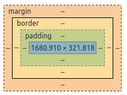
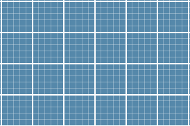

##2、背景与边框（1~8）
####1、半透明边框 border | background-clip
---
现在的透明效果运用的是非常普遍，尤其是在背景中。比如半透明磨砂质感的登录框，瞬间提升格调。但是在本章，我们的场景是边框。

乍一想非常简单，设置border为半透明颜色不就可以了吗？很显然没那么简单～就能得到半透明的边～设置半透明后，你会发现border未响应。下面将要介绍一个在background中比较重要的一个属性background-clip：背景覆盖区域。

盒模型大家一定不陌生：margin-border-padding-content

如果此时我们填充一个背景色，就会发现背景色覆盖的区域是 border-padding-content 三个区域。控制的条件其实就是background-clip，默认值是 border-box，如果此时我们把background-clip:padding-box,就可以发现背景色只覆盖了padding-content,而此时我们就可以对border为所欲为了。

####2、多重边框 box-shadow| outline
---
多重边框就是周边有n多个框框，主要用到box-shadow | outline两种技术。细节不再介绍，简要说明二者的区别

box-shadow 随border形状变化，可以设置多个框框
outline 只可以是矩形，只能设置一个边框

####3、灵活的背景定位 background-position|background-origin|calc()
---
意思就是我们可以灵活的设置背景位置，也是一个比较常用的姿势。

background -position 位置偏移设置，非常容易理解，但是要注意兼容性以及回退的方案的处理，本书好多的属性兼容性还没有那么乐观。

下面介绍的 background-origin要跟（1、半透明边框中）的background-clip区别开来。

background-origin，也可以理解为背景覆盖范围，其默认值同样是border-box。

background-clip是比较直接的“裁剪”，背景所覆盖的区域始终是border-box范围，当值设置为padding-box时，背景区域不变，但之前border上的背景会被裁剪掉。
而background-origin被设置为padding-box时，背景覆盖的范围不再是border-box,而是变成了padding-box.即border上的背景会移动到padding-box中。
比较值得注意的是，我们的background-position是相对于background-origin做偏移的。

除了position和相对取巧的origin来说，也许下面这种方法才是最万能的，或者说希望是未来比较万能的方法。就是让我们感激涕零的为数不多的css函数calc()！
####4、边框内圆角 box-shadow| outline
---
书中的方法比较取巧，其实用border-image更好。不过Lea巧妙的利用了outline 和box-shadow也是比较神奇。

大意方法就是 outline 在外层形成一个矩形边框，然后用box-shadow填充outline与border之间的空隙。
由于Lea透露以后的outline也会跟随border而改变，因此可以不用考虑这个方法啦。

####5、条纹背景 liner-gradient
---

上面的仅仅都是热身，我们现在才要进入状态了。现在比较流行简洁大气的页面效果，渐变的运用因此将会越来越广泛。

下面主要就线性渐变做一些笔记，更复杂的不在此记录。

水平条纹
liner-gradient([方向]，颜色，[坐标]，颜色，[坐标]…………),中括号中可以省略的值。

1，方向：即渐变方向，默认是从上到下，即竖直渐变
2，颜色：#各种颜色表达式
3，坐标：可以计量单位，也可以百分比。

举个例子更加清晰 liner-gradient(#000,25%,#fff,55%),这个表达式的意思简要如下：
从上到下，0 ~ 25%高度之间的颜色是#000,55%到100%高度是#fff，而中间25% ~ 55%的区域就是#000和#fff的渐变区域。

特别的值是0,当一个颜色的坐标是0时，则代表的是取他前面设置的坐标的最大值。 如liner-gradient(#000,25%,#fff,0)  就等于 gradient(#000,25%,#fff,25%)，那我们容易理解0~25%是#000，25%~100%是# fff，他们中间的渐变区域则就是0，因此我们得到的就会是黑白条纹装！

是不是很简单？根据角度的不同我们就可以实现：垂直条纹、斜向条纹。使用repeating-linear-gradient属性我们还可以实现无缝拼接的多条条纹啦.

####6、复杂的背景图案 liner-gradient | SVG
---
这个是非常大开眼界的一章。利用线性渐变的组合实现了让人眼花缭乱的背景图案，反正我是花眼了。

这里也介绍了一个新的知识SVG： 使用 XML 格式定义图像的可缩放矢量图形。

SVG也是比较“大”的一个知识点，此书的很多知识展开来都是篇幅很大的内容，但是我写的笔记并没有做出扩展，希望后来的同学们的笔记会有深入的介绍，万分感激。
####7、伪随机背景
---
伪随机，即看起来像随机的，比较自然。不像下图看起来十分规整，然而略无聊的效果。人为的让背景出现随意的效果，提高我们的用户体验，如颜色的交叉，尺寸的变化等等。  

####8、连续的图像边框 border-image | background-*
---
第1节我们实现了一个半透明边框，下面我们要实现的是更加酷炫的图像边框。
说到图片边框，首先我们大脑中想到的应该是border-image

给个张鑫旭大大的border-image的链接，没有用过的可以去感受一下border-image的魅力。
http://www.zhangxinxu.com/wordpress/2010/01/css3-border-image/

但是由于边框的大小并不固定，大小改变时，border-image会涉及到重复，拉伸等，为了避免变形，我们的border-image可以应用在色彩和图案比较规律的图片。
若是在本章的例子中，由于图片是不规则的，最好还是采用Lea提供的方法。
设置两层背景，通过对背景background-clip,background-origin,以及background-position的设置，来实现边框图片的自适应大小。

PS:我实际操作后，觉得还是border-image更好一些，小伙伴们也可以多多实践，找到最适合自己的方法。