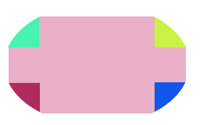
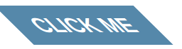
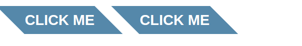
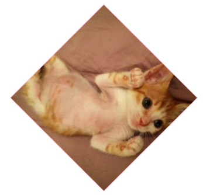
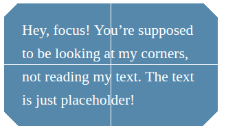
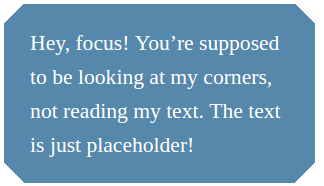
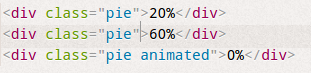
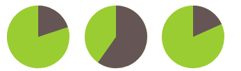

##3、形状（9~12）
###9、自适应椭圆 border-radius
---
当我们需要圆角样式时，毫无例外，我们都会想到border-radius属性，最常见的需求是四边弧度都相同。这时我们只需给其设置一个固定的值即可实现，如border-radius : 5px;

但实际上作用远不止如此简单

1. 椭圆角

 椭圆即水平半径！=垂直半径,border-radius允许我们分别设置水平半径和垂直半径
`border-radius : 10px / 5px；`

2. 自适应大小

 万能的百分比
`border-radius : 50% ;`

3. 四角各不同

 可以写在一起（顺时针方向），也可以分开定义，可以混用水平半径和垂直半径：

 `border-radius : 10px / 5px 20px;`

   意思很明了 四角的水平半径均是10px，左上右下垂直半径 5px，左下右上垂直半径 20px；
   
   左上，右上，右下，左下；
   左上，右上左下，右下；
   左上右下，右上左下；
   四角；
     
   
  *思考题:border-radius与border的联系*
   
###10、平行四边形skew|伪元素
---
在这里我们遇到了一个问题，当我们将矩形的元素利用skew改变成平行四边形的时，内部的文字等内容也会随之发生倾斜，这是我们不需要的变动。  

  

1. 元素嵌套
	元素嵌套就是在外层再套一层元素，我们对外层元素进行变形后，再对内层元素进行反向反转变形，从而达到消褪内层的内容的变形的目的。
	这种方法可以解决上述问题，但是不太赞成，其复杂了html的结构，而且很多其他的变形不容易甚至不能反转。
    <pre><code>
    .button { transform: skewX(45deg); }
	.button > div { transform: skewX(-45deg); }
    </code></pre>
2. 伪元素
    Lea提出了伪元素的解决办法：用伪元素代替元素发生倾斜，而真正的元素不变动。在视觉上同样可以实现平行四边行的效果。
	<pre><code>
    .button::before {
	content: ''; /* To generate the box */
	position: absolute;
	top: 0; right: 0; bottom: 0; left: 0;
	z-index: -1;
	background: #58a;
	transform: skew(45deg);
}
    </code></pre>
    我们可以简单的理解为：伪元素是一个新的图层，我们通过==两个图层的叠加==，从而可以更简单的实现所要达到的效果。这种方法非常适用于：我们想变形一个元素而又不想变形他的内容时的情况。

上面两种方法都可以实现需求  

###11、菱形的图片rotate | clip-path
---
菱形的变形，和平行四边形的需求很相似，都是只需要改变形状而不改变内容。
在这里就可以体现嵌套方法的一些局限性。

1. 元素嵌套
	我们将外层的元素进行旋转，将内层的元素进行反转转后后，出现如下效果：  
    
	
    
    <pre><code>
        .diamond {
        width: 250px;
        height: 250px;
        transform: rotate(45deg);
        overflow: hidden;
        margin: 100px;
        border:1px solid pink;
    	}
   	 .diamond img {
        max-width: 100%;
        transform: rotate(-45deg);
        z-index: -1;
        position: relative;
   	 }
    </code></pre>
    
    代码中我们为了使得图片的大小跟外层`div`一致，设置了`width:100%`，但反而会造成了图片的宽度被限制等于`div`的边长了，于是就显示成了一个奇怪的八边形的造型。因此我们在将内层反向变形的时候，对齐相应放大，才能得到我们想要的效果。
  <pre><code>
 .diamond img {
    transform: rotate(-45deg) scale(1.42) ;
 }
</code></pre>
    
    
    
2. 裁切路经方案

    知道photoshop里的path吗？或者说canvas里的path吗？对！答案就是path!别说菱形，其他的更复杂的更不规则的图形也不在话下。

    下面我们来了解了解 clip-path：
    clip-path翻译为裁剪路径，主要有以下属性：

    >   /* 引用一个内联的 SVG <clipPath> 路径*/
      clip-path: url(#c1); 
      /* 引用一个外部的 SVG  路径*/
      clip-path: url(path.svg#c1);
      /* 多边形 */
      clip-path: polygon(5% 5%, 100% 0%, 100% 75%, 75% 75%, 75% 100%, 50% 75%, 0% 75%);
      /* 圆形 */
      clip-path: circle(30px at 35px 35px);
      /* 椭圆 */
      clip-path: ellipse(65px 30px at 125px 40px);
      /* inset-rectangle() 将会替代 inset() ? */
      /* rectangle() 有可能出现于 SVG 2 */
      /* 圆角 */
      clip-path: inset(10% 10% 10% 10% round 20%, 20%);

    我们这里用到的主要是多边形属性
    ` clip-path: polygon(50% 0, 100% 50%， 50% 100%， 0 50%);`

    上面的数值组也很容易理解，在原矩形框中，我们标出上面四个坐标的点，连成线，可以看到正好可以裁剪出一个菱形。 clip-path 比较赞的一点是，在裁剪的区域外，即原矩形裁剪菱形剩下的部分，所有的动作，事件等都不会执行，就相当于是“空白”的区域。

    ==最大的遗憾应该就是兼容性的问题，至少我电脑中的火狐浏览器不支持。==

###12、切角效果
---
哎想来我所谓的切角都是用图片来实现的……
Lea给了三种方法：
- 第二章渐变
    - 直线切角效果  

        
        <pre><code>
        div {
        background: #58a;
        background: linear-gradient(135deg, transparent 15px, #58a 0) top left,
                    linear-gradient(-135deg, transparent 15px, #58a 0) top right,
                    linear-gradient(-45deg, transparent 15px, #58a 0) bottom right,
                    linear-gradient(45deg, transparent 15px, #58a 0) bottom left;
        background-size: 50% 50%;
        background-repeat: no-repeat;

        padding: 1em 1.2em;
        max-width: 12em;
        color: white;
        font: 150%/1.6 Baskerville, Palatino, serif;
    }
        </code></pre>

	==疑问==我们背景设置50%的时候，中间会出现‘裂纹’，调整`background-size:51% 51%`会消失。
    
    
    - 弧形切角效果
    <pre><code>
    background:   radial-gradient(circle at top left, transparent 15px, #58a 0) top left,
                    radial-gradient(circle at top right, transparent 15px, #58a 0) top right,
                    radial-gradient(circle at bottom right, transparent 15px, #58a 0) bottom right,
                    radial-gradient(circle at bottom left, transparent 15px, #58a 0) bottom left;
    </code></pre>

-  第二章中的知识border-image与内联SVG
	还记得前面说的border-image的九宫格吗？联合svg应用真的非常赞。
    >svg可以实现与尺寸完全无关的完美缩放
    
    <pre><code>
    div {
	border: 21px solid transparent;
	border-image: 1 url('data:image/svg+xml,\
	                      <svg xmlns="http://www.w3.org/2000/svg" width="3" height="3" fill="%2358a">\
	                      <polygon points="0,1 1,0 2,0 3,1 3,2 2,3 1,3 0,2" />\
	                      </svg>');
	background: #58a;
	background-clip: padding-box;
	
	padding: .2em .3em;
	max-width: 12em;
	color: white;
	font: 150%/1.6 Baskerville, Palatino, serif;
}
    </code></pre>
    
-   第11节中的path

	<pre><code>
    div {
	background: #58a;
	-webkit-clip-path: 
		polygon(20px 0, calc(100% - 20px) 0, 100% 20px, 100% calc(100% - 20px),
		calc(100% - 20px) 100%,
		20px 100%, 0 calc(100% - 20px), 0 20px);
	clip-path:
	 		polygon(20px 0, calc(100% - 20px) 0, 100% 20px, 100% calc(100% - 20px),
	 		calc(100% - 20px) 100%,
	 		20px 100%, 0 calc(100% - 20px), 0 20px);
	
	padding: 1em 1.2em;
	max-width: 12em;
	color: white;
	font: 150%/1.6 Baskerville, Palatino, serif;
}
    </code></pre>

###13、梯形标签页
---
同样的，我们也是希望梯形的效果是，形状是梯形，而其中的内容不变形。
在这里我们就不可以采用嵌套元素的方法了，因为这里涉及到css的3d变形，而3d变形是不可逆的。

只能采用伪元素的方法了。
<pre><code>
nav a::before {
	content: ''; /* To generate the box */
	position: absolute;
	top: 0; right: 0; bottom: 0; left: 0;
	z-index: -1;
	border-bottom: none;
	border-radius: .5em .5em 0 0;
	background: #ccc linear-gradient(hsla(0,0%,100%,.6), hsla(0,0%,100%,0));
	box-shadow: 0 .15em white inset;
	transform: scale(1.1, 1.3) perspective(.5em) rotateX(5deg);
	transform-origin: bottom;
}
</code></pre>

####14、简单的饼图
---
这个饼图看起来有点费脑筋，主要用了以下两种方法
- 变形
	这里涉及到了一些`css`动画知识，如果没有动画基础，简易看完第八章的动画，再回来学习。、
    下面这段代码中，有一个很巧妙的`变量`，没错，可以称之为`变量`的关键字`currentColor`
    >`currentColor`是指当前文本颜色。
    
    如代码中的`color:#655`是当前的文本颜色，那么css中的currentColor指的就是`color`的颜色。
    
    <pre><code>
   .pie {
        width: 100px; height: 100px;
        border-radius: 50%;
        background: yellowgreen;
        background-image: linear-gradient(to right, transparent 50%, currentColor 0);
        color: #655;
    }

    .pie::before {
        content: '';
        display: block;
        margin-left: 50%;
        height: 100%;
        border-radius: 0 100% 100% 0 / 50%;
        background-color: inherit;
        transform-origin: left;
        animation: spin 3s linear infinite, bg 6s step-end infinite;
    }

    @keyframes spin {
        to { transform: rotate(.5turn); }
    }
    @keyframes bg {
        50% { background: currentColor; }
    }
    </code></pre>

- svg

	这个方法也许会试用一些，可以控制饼状图显示的百分比，也可以控制是静态的还是动态的饼图。  
    
	  
    
	  
    
	第三个饼是动态的哦～～
    为了实现可以前端控制饼状图的百分比，借助了js函数：
    <pre><code>
    function $$(selector, context) {
	context = context || document;
	var elements = context.querySelectorAll(selector);
	return Array.prototype.slice.call(elements);
} 

 $$('.pie').forEach(function(pie) {
	var p = parseFloat(pie.textContent);
	var NS = "http://www.w3.org/2000/svg";
	var svg = document.createElementNS(NS, "svg");
	var circle = document.createElementNS(NS, "circle");
	var title = document.createElementNS(NS, "title");
	
	circle.setAttribute("r", 16);
	circle.setAttribute("cx", 16);
	circle.setAttribute("cy", 16);
	circle.setAttribute("stroke-dasharray", p + " 100");
	
	svg.setAttribute("viewBox", "0 0 32 32");
	title.textContent = pie.textContent;
	pie.textContent = '';
	svg.appendChild(title);
	svg.appendChild(circle);
	pie.appendChild(svg);
});
    </code></pre>
    下面是css代码：
    <pre><code>
    .pie {
        width: 100px;
        height: 100px;
        display: inline-block;
        margin: 10px;
        transform: rotate(-90deg);
    }

    svg {
        background: yellowgreen;
        border-radius: 50%;
    }

    circle {
        fill: yellowgreen;
        stroke: #655;
        stroke-width: 32;
    }

    @keyframes grow { to { stroke-dasharray: 100 100 } }

    .pie.animated circle {
        animation: grow 2s infinite linear;
    }
    </code></pre>

