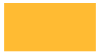
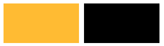
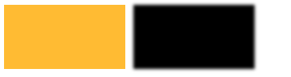
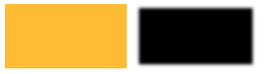
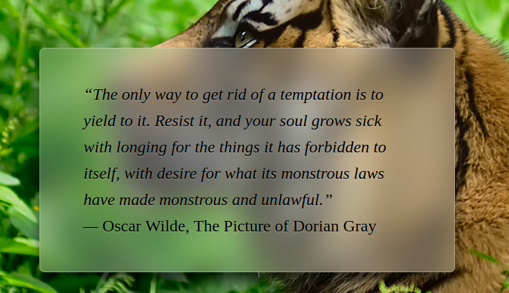

##4、视觉效果（15~19）
###15、单侧投影 | box-shadow
首先来看一下box-shadow 完整的表达式
> box-shadow: h-shadow v-shadow blur spread color inset;

- h-shadow  水平偏移量
- v-shadow  垂直偏移量
- blur  模糊半径 
- spread 扩张半径
- color 颜色
- inset 方向（向内/向外）

主要来说说模糊半径和扩张半径。
1. ==模糊半径==   : 5px 的效果是在 投影边框外会多5px的模糊阴影区，因此模糊后的阴影 上下左右 都比原来的尺寸各大 5px。
2. ==扩张半径==   : 5px 的效果是投影的上下左右各增加 5px的尺寸，注意，模糊的效果不受扩张半径的影响，就好像扩展半径处理的是投影层不模糊的部分。且扩张半径可以取负值。

下面如图来说明会更清晰一些：
1. 有一张width:150px；height:80px的黄色区域
	
2. 设置一个只有偏移的shadow：box-shadow:160px 0  black;
	
3. 对shadow设置5px半径的模糊：box-shadow:160px 0 5px black;

	
4. 对shadow设置-5px的扩张：box-shadow:160px 0 5px -5px black;

	

从上面的图片可以看出设置扩展半径时，对模糊半径并没有影响，他只是影响了shadow的尺寸。
而且不忘忘记我们在第二章我们介绍border-shadow时，曾说过可以设置多个border-shadow的值哟～～
 
通过blur spread 以及shadow组合，我们可以很容易的实现单边，邻边，双侧等投影效果啦

- - -

###16、不规则投影 | filter

在第二章多重边框一节，我们学习知道了border-shadow是同border-radius的形状一致的，在第三节我们也学习了一些特别的，不规则的效果，而此时，border-shadow就会显得力不从心，他并不能跟随者特别的形状而变化，因此我们需要了解另一个强大的功能：滤镜。

>filter: none | blur() | brightness() | contrast() | drop-shadow() | grayscale() | hue-rotate() | invert() | opacity() | saturate() | sepia() | url();

滤镜有许多种，其中drop-shadow()是我们这一节要学习的，其他的部分滤镜后面也会用到。

>drop-shadow(h-shadow v-shadow blur spread color)

与border-shadow相比，drop-shadow少了 扩张半径和方向的参数，这里不再介绍。
==但是==滤镜是用于整个元素的，因此我们使用drop-shadow 不仅对边框产生了投影的作用，对元素任何非透明的部分也会一起打上阴影。
- - -
###17、染色效果
[前排提示：不要一次性尝试太多滤镜太多效果- -会瞎--]

首先认识一下与颜色相关的几个滤镜

 - sepia(%)黄褐色滤镜 –我对颜色没研究，不知道为什么会有这种滤镜，难道黄褐色在颜色处理中有特别的作用？？
 - saturate(%)图像饱和度。
 - hue-rotate(deg)给图像应用色相旋转。
 - grayscale(%)将图像转换为灰度图像。
 - brightness(%)给图片应用一种线性乘法，使其看起来更亮或更暗。

==特别的==滤镜支持动画，如果我们在例如hover动作改变滤镜的时候，可以增加一些动画效果transition，使得变化平缓，不会那么突兀。

除了上面提到的滤镜，我们还可以使用混合模式mix-blend-mode。

混合模式支持挺多效果
>mix-blend-mode: normal;          //正常
mix-blend-mode: multiply;        //正片叠底
mix-blend-mode: screen;          //滤色
mix-blend-mode: overlay;         //叠加
mix-blend-mode: darken;          //变暗
mix-blend-mode: lighten;         //变亮
mix-blend-mode: color-dodge;     //颜色减淡
mix-blend-mode: color-burn;      //颜色加深
mix-blend-mode: hard-light;      //强光
mix-blend-mode: soft-light;      //柔光
mix-blend-mode: difference;      //差值
mix-blend-mode: exclusion;       //排除
mix-blend-mode: hue;             //色相
mix-blend-mode: saturation;      //饱和度
mix-blend-mode: color;           //颜色
mix-blend-mode: luminosity;      //亮度
mix-blend-mode: initial;         //初始
mix-blend-mode: inherit;         //继承
mix-blend-mode: unset;           //复原

[混合模式演示实例](http://www.zhangxinxu.com/study/201505/css3-css4-background-blend-mode.html)

- - -

###18、毛玻璃效果 filter | blur

还记的我们在第二章半透明边框那一节提到的提升逼格的磨砂效果吗？现在我们要更深入的了解啦。

Lea提到了一个场景，大背景比较花哨，背景上的div框设置透明色。此时div框里的文本的展示会非常被花哨背景干扰。
此时Lea提出了一个很赞的方案，将大背景被div框覆盖的区域进行模糊处理，从而达到磨砂玻璃的效果。
在这里使用的便是blur()高斯模糊滤镜了。

>blur(px)：给图像设置高斯模糊。"radius"一值设定高斯函数的标准差，或者是屏幕上以多少像素融在一起， 所以值越大越模糊；如果没有设定值，则默认是0；这个参数可设置css长度值，但不接受百分比值。

从要实现的效果来看，我们好像仅仅是改变了div的背景是高斯模糊，而div的内容并不需要模糊，但是我们都知道，滤镜是会影响区域中所有的部分的，他并不会判断那些需要特效，那些不需要。即如果我们去模糊大背景，那么整个背景都会模糊，而如果我们去模糊div框，则其中的内容也会模糊。这样的需求熟悉吗？，在第三章平行四边形的时候也遇到过，还记的我们是用伪元素解决的，同样的，我们也可以借助伪元素实现我们所需要的毛玻璃效果。

效果酷炫吧～～

---
###19、折角效果

折角效果是线性渐变的加强应用。但是尝试了很多次，始终不慎满意，按照Lea的方案，折角边仍然觉得毛躁不平滑。

