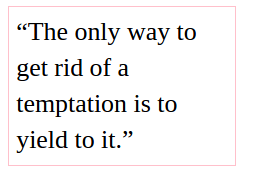
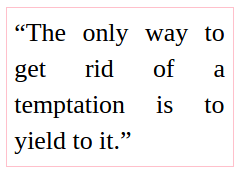
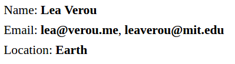
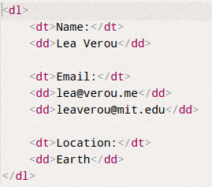
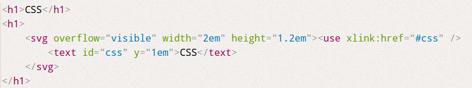

##5、字体排印（20~28）
###20、连字符断行

hhh在我们中文中，是不会出现介个样子的问题滴。

下图中，当我们书写一段文本时，如果一个单词超出了文本框，则他会被换到下一行。这个效果不怎么好看。

在英文排版中，一般比较偏向字符的排版模式是两边对齐`text-align: justify;`，但是下图中的两端对齐看起来似乎也并不好看，尤其第二行，空格太多。

针对上面一种情况，css3新增了一个断词折行的属性 `hyphens`
>- none; 无
-  manual; 自定义断词标志
- auto; 用-断词

断词确实可以改善两边对齐的样式，但是可惜的是，兼容性并不是很乐观。我电脑中的chrome和火狐都没有支持。

关于断词换行还有`word-break`、`word-wrap`，但是两者也都无法改善这个情况。

---
###21、插入换行

下面的样式需求应该是万分常见的。在我没看内容的时候，觉得非常简单。每一行直接`

`不就可以实现了吗？

在继续看下去的时候，忽然明白了`语义化`的意义。
在我们编写`html`的时候，如果我们要添加一个超链接，那么我们会想到`<a>`标签，如果我们想添加一张图片我们会想到``标签。但是如果我们要实现上图中的样式呢，我们用`
`表示列表框，用`
`书写列表项，那也是可以的，但是要知道`
`是一个‘无意义’的标签，当我们看到一个`
`不会知道这一块代表这什么内容。
>
 可定义文档中的分区或节（division/section）。
	
 标签可以把文档分割为独立的、不同的部分。它可以用作严格的组织工具，并且不使用任何格式与其关联。
	如果用 id 或 class 来标记 `
`，那么该标签的作用会变得更加有效。

而在`html`中，我们有`<dl><dt><dd>`专门表示列表项的标签。
>`<dl> `标签定义了定义列表（definition list）。
	`<dl>` 标签用于结合`<dt> `（定义列表中的项目）和 `<dd>` （描述列表中的项目）。

如果我们使用`<dl>`，看到标签，就会知道我们要展示的一个列表项，这样语义会更加清晰一些，识别度也会更高。

当然了,`<dt>`，`<dd>`都是块级标签，我们需要对其进行进一步处理。下面的代码比较易于理解，但同时也是非常有技巧的，我自己先试了试，虽说实现了效果，但是代码跟Lea比，还是差了很多。

<pre><code>
dt, dd {
	display: inline;
	margin: 0;
}

dd {
	font-weight: 600;
}

dd + dt::before {
	content: "\A";
	white-space: pre;
}

dd + dd::before {
	content: ', ';
	font-weight: normal;
	margin-left: -.25em;
}

</code></pre>

>white-space
- normal	默认。空白会被浏览器忽略。
- pre	空白会被浏览器保留。其行为方式类似 HTML 中的` <pre> `标签。
- nowrap	文本不会换行，文本会在在同一行上继续，直到遇到`   `标签为止。
- pre-wrap	保留空白符序列，但是正常地进行换行。
- pre-line	合并空白符序列，但是保留换行符。
- inherit	规定应该从父元素继承 white-space 属性的值。

---
###22、文本的斑马条纹 background-image | linear-gradient

在css中，我使用用伪类nth-child()很容易实现table的条纹效果，但如果是一段文本呢？

解决方法：背景条纹。
<pre><code>width:20em;
padding: .5em;
line-height: 1.5;
background: hsl(20, 50%, 95%);
background-image: linear-gradient(rgba(120,0,0,.1) 50%, transparent 0);
background-size: auto 3em;
background-origin: content-box;
font-family: Consolas, Monaco, monospace;
</code></pre>

注意：当修改line-height时，注意修改background-size的值。

---
###23、调整tab的宽度

当文本中出现代码块`<pre><code>`时，一个tab默认所占的长度为8个字符。
有的时候也许这个尺寸并不合适。
在css3中我们可以通过` tab-size :2`来设置tab的占位。

###24、连字
兼容性貌似需要进一步提升，我的电脑完全看不到这种效果。下面仅放出代码，有兴趣的同学可以研究。
<pre><code>
body {
	font: 200%/1.6 "Adobe Caslon Pro", Baskerville, serif;
	font-variant-ligatures: common-ligatures discretionary-ligatures historical-ligatures;
}
</code></pre>

---
###25、华丽的符号

所谓的华丽的字符其实也是字体。有一些特别的符号或者文字我们想用特定的字体表现的时候，就在css中将其字体引入即可。
引入字体的时候要注意顺序，和别的css属性不用，我们的字体是先从最优先的字体开始检索，第一字体库中找不到相应的字体时，会在第二字体库中，一次类推。

<pre><code>
@font-face {
	font-family: Ampersand;
	src: local('Baskerville-Italic'), local('GoudyOldStyleT-Italic'), local('Garamond-Italic'), local('Palatino-Italic');
	unicode-range: U+26;
}

h1 {
	font-family: Ampersand, Helvetica, sans-serif;
}
</code></pre>

---

###26、自定义下划线

我们都知道a标签中有个下划线`text-decoration:underline`样式，但我们无法对该下划线的样式进行自定义，
这一章节我们可以实现一些漂亮的下划线样式，既然不可以直接设置下划线，我们可以考虑曲线救国。

==边框？==不可以，因为他会在字符的下方，而下划线不是这样的。
==阴影？==和边框也是一样的问题。

Lea的方法使用了强大的==background==。

学习了css揭秘之后，慢慢了才知道background的强大！！

<pre><code>background: linear-gradient(gray, gray) no-repeat;
background-size: 100% 1px;
background-position: 0 1.02em;</code></pre>

下划线在遇到字母的时候留出空隙，我们可以借助背景色的文字投影（后面小节有介绍）来实现。

`text-shadow: .05em 0 white, -.05em 0 white;`

---

###27、现实中的文字效果

==凹进效果==：出现在底部的浅色投影。或者出现在顶部的暗色投影会让人产生物体凹进平面内的错觉。
==凸起效果==：出现在地不得暗色投影，或者出现的顶部的浅色投影会让人产生物体从平面凸起的错觉。

这种方法来源于现实，我们早已习惯了光源总是悬在头顶，因此凹进平面的物体，在顶部有阴影，而在底部则光线较亮。
什么时候选择顶部阴影，什么时候选择底部浅影呢？这个是要根据实际场景来判断。我们的立体感主要来源字体和其阴影的对比，对比越明显，则立体感会越强。

因此当字体颜色较深时，我们应该用浅色效果，当字体颜色较浅时候，我们应该采用深色效果。

- 背景色浅，文字颜色深。
	底部浅影
- 背景色深，文字颜色浅
	顶部阴影。

1. 凸版印刷效果

	<pre><code>background: hsl(210, 13%, 60%);
color: hsl(210, 13%, 30%);
text-shadow: 0 1px 1px hsla(0,0%,100%,.8);</code></pre>
2. 空心字效果
	描边。
	- text-shadow
	<pre><code>color: white;
	text-shadow: 1px 1px black, -1px -1px black, 1px -1px black, -1px 1px black;</code></pre>
	-  svg
        
        <pre><code>h1 text { fill: currentColor }
        h1 use {
            stroke: black; 
            stroke-width: 6;
            stroke-linejoin: round;
        }</code></pre>
3. 文字外发光效果
<pre><code>a {
        color: #ffc;
        text-decoration: none;
        transition: 1s;
}
a:hover { text-shadow: 0 0 .1em, 0 0 .3em; }</code></pre>

4. 文字凸起效果
<pre><code>body {
        background: #58a;
        color: white;
        text-shadow: 0 1px hsl(0,0%,85%),
                     0 2px hsl(0,0%,80%),
                     0 3px hsl(0,0%,75%),
                     0 4px hsl(0,0%,70%),
                     0 5px hsl(0,0%,65%),
                     0 5px 10px black;
        font: bold 500%/1 Rockwell, serif;
}</code></pre>

---
###28、环形文字

使用的是svg技术
