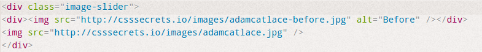
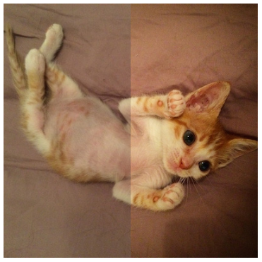
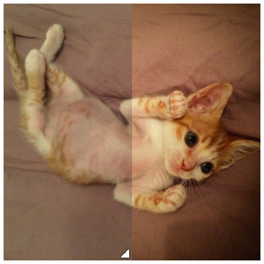

##6、用户体验（29~35）

写在用户体验之前，我们在开发中，会有产品介入测试，他们发现的”bug”通常都是很多小细节，比如图标选择，间距，文案展示，缩放比例，页面跳转，超链接，边框等等，有的时候来来回回改了n多次，甚至又恢复最初模样。虽然过程中我和设计都觉得被折腾的很吐血，但最终看到效果体验确实要更好，于是比较坚持产品测试……

###29、 选用合适的鼠标光标
---
css3在原有的光标库中进行了扩充，其中特别的是[空],[返回],[禁用],[放大],[缩小]等常用的意义光标。

前不久我在项目中使用了一个tab，它的光标只是一个普通的箭头。然而我并没有意识到这一点，只是觉得有什么地方怪怪的，组长瞄我的页面一下就发现是箭头的问题，果然改了之后，觉得就比较自然了。

###30、 扩大可点击区域
---
Lea提出了一个Fitts法则：人类移动到某个目标区域所需最短时间是由目标距离与目标宽度之比所构成的对数函数。

尤其在一个的小的区域范围内，我们希望交互不会受到范围而变得不友好。比如我们有个很小的图标，我们一定要将鼠标放到其上方才可以点击，这样的话也许我要花几秒钟去定位，尤其在页面内容很多的时候会更加困难。

如果扩大可点击区域，将会很大程度上提高用户体验。

1. 用透明边框来实现扩大区域：

    鼠标对元素的边框`border`的交互可以触发鼠标事件（==注意==：描边和投影不可以）。
    如果区域变形的话，使用`background-clip:padding-box`将背景控制在border内部。

2. 使用伪元素来实现，尺寸可以按需设置
	<pre><code>
    Button{
    	position:relative;
    }
    Button::before{
        content:’’;
        position:absolute;
        top:-10px;
        right:-10px;
        bottom:-10px;
        left:-10px;
    }
    </code></pre>
    

---
###31、自定义复选框
---
首先介绍一个概念：==替换元素==
>css2规范所述。替换元素的特征在于其内容超过了css格式化模型的范畴，比如图片，嵌入的文档或者小应用程序等。简单理解即仅仅用css不可以实现样式的改变。

复选框就是属于替换元素的范围。

在css2中，仅通过css是无法对复选框进行样式设计的。在css3中，新增了一个伪元素状态:checked，这个状态是指复选框被选中时才会被匹配。

我们不能用css改变复选框的样式，但是我们可以通过对label设置伪元素样式来模仿复选框，并对其进行样式美化，而原本的复选框则进行隐藏。label样式加上checkbox的状态：checked，使得我们可以用css分别控制复选框（其实是label）的样式。

<pre><code>
input[type="checkbox"] + label::before {
    content: '\a0';
    display: inline-block;
    vertical-align: .2em;
    width: .8em;
    height: .8em;
    margin-right: .2em;
    border-radius: .2em;
    background: silver;
    text-indent: .15em;
    line-height: .65;
}
input[type="checkbox"]:checked + label::before {
    content: '\2713';
    background: yellowgreen;
}
input[type="checkbox"]:focus + label::before {
        box-shadow: 0 0 .1em .1em #58a;
}

input[type="checkbox"]:disabled + label::before {
        background: gray;
        box-shadow: none;
        color: #555;
        cursor: not-allowed;
}
</code></pre>

###32、通过阴影弱化背景
---
即是平时我们使用的==遮罩层==。
我之前写遮罩层的时候，会增加一个遮罩层元素，这是一个比较一般的方法。

1. 伪元素方案
	即当触发遮罩事件时，js为遮罩增加一个有遮罩效果的css类，和上面的常规方法很相似，都需要js辅助。
2. box-shadow方案
	box-shadow是给弹框增加了一个类似遮罩效果的边框阴影，有比较大的局限性，尺寸或者阻止鼠标交互都不甚理想。
3. backdrop方案
	`<dialog>`showModal自带遮罩层，兼容性现在还不是很好，本机火狐不能支持。

###33、通过模糊弱化背景
---
有点眩晕哈，个人不太喜欢这个效果

###34、滚动提示
---

###35、交互式的图片对比
---
在这里认识了`resize`的属性，可以调节div的大小。

>指定一个div元素，允许用户调整大小：
- none	用户无法调整元素的尺寸。
- both	用户可调整元素的高度和宽度。
- horizontal	用户可调整元素的宽度。
- vertical	用户可调整元素的高度。

可以联想到`textarea`的效果，一般文本框的右下角都有一个可以拖动文本框大小的标记，其实就是`resize`的值默认取`both`，而别的元素一般默认值是`none`。

我们的想法是，对比两个图片，将其中的一张放置在‘底层’，另一张放置在'上层',然后缩放'上层'图片进行对比。
==注意==，缩放‘上层’的图片是指缩放图片的显示内容，并不是缩放图片，因此其实我们缩放的是上层的显示的区域，我们需要在上层图片外层加入一层`div`框供我们缩放区域。  

  

<pre><code>
.image-slider {
	position:relative;
	display: inline-block;
}
</code></pre>
<pre><code>
.image-slider > div {
	position: absolute;
	top: 0; bottom: 0; left: 0;
	width: 50%;
	max-width: 100%;
	overflow: hidden;
	resize: horizontal;
}
.image-slider img {	
	display: block;
	user-select: none;
}
</code></pre>  

  

从上面的css代码可以看出我们实现了双层图片（上层图片暗，下层图片亮）的对比，通过横向`resize: horizontal`拖动图片区域，实现对比。上层图片宽度最小值是50%，==重要的==是别忘记设置==最大宽度==，否则`resize`允许我们可以无限放大区域。

大家可以注意到，右下角拖放的标记非常不明显，导致用户可能不知道可以拖放，于是Lea用伪元素实现了一个拖拽的图标，并且鼠标放上去还有拖动的鼠标手势`ew-resize`。

<pre><code>
.image-slider > div:before {
	content: '';
	position: absolute;
	right: 0; bottom: 0;
	width: 12px; height: 12px;
	padding: 5px;
	background: linear-gradient(-45deg, white 50%, transparent 0);
	background-clip: content-box;
	cursor: ew-resize;
	-webkit-filter: drop-shadow(0 0 2px black);
	filter: drop-shadow(0 0 2px black);
}
</code></pre>

