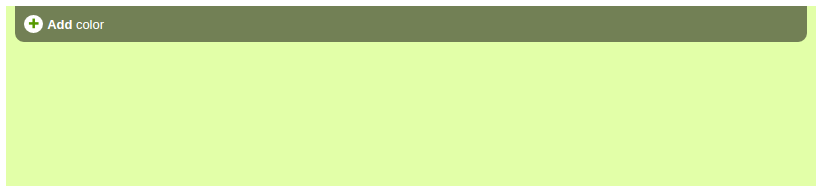
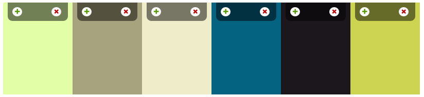
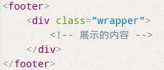
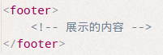
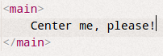
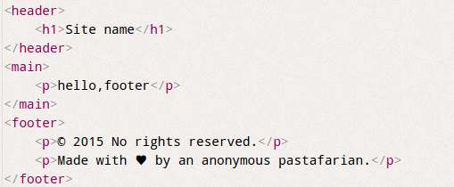

##7、结构与布局（36~41）
###36、自适应内部元素
我们都知道，html是高度自适应的，随着内容的高度变化而自适应。
css3中，我们也可以实现宽度自适应了，通过`width：min-content`可以实现==宽度==自适应了！
真是非常便利，但是兼容性还有待提升，大家在使用的时候注意回退。

<pre><code>
figure {
	max-width: 300px;
	max-width: min-content;
	margin: auto;
}
</code></pre>

---
####37、精确控制表格宽度
css2中表格有个鲜为人知的属性` table-layout`表格布局，默认值是`auto`：自动表格布局算法。

当我们将 `table-layout`设置`fixed`时，可以设置表格的宽度，默认是等宽。

案例中的图片“越界”了，我们可以设置img的宽度为100%，不过这样就会将图片显示缩小了。

---
####38、根据兄弟数量来设置样式

我们常常会遇到上面的需求：显示的元素的个数不同，显示的效果也不同。
在css中，我们得知一些结构性伪类选择器，在本章我们主要是使用了`only-child`，`nth-child`两种伪类。

>:only-child表示的是一个元素是它的父元素的唯一一个子元素。
:nth-child()选择某个元素的一个或多个特定的子元素；

>only-child 相当于 :first-child:last-child(1) 当第一个元素同时也是最后一个元素，则从逻辑上说他就是唯一的元素。
>:nth-child()可以选择某个的一个或多个特定的子元素，你可以按这种方式进行选择：
- :nth-child(length); /*参数是具体数字*/
- :nth-child(n); /*参数是n,n从0开始计算*/
- :nth-child(n×length) /*n的倍数选择，n从0开始算*/
- :nth-child(n+length);  /*选择大于length后面的元素*/
- :nth-child(-n+length); /*选择小于length前面的元素*/
- :nth-child(n×length+1); /*表示隔几选一*/
 值得注意的是：nth-child(0)没有选择元素，nth-child(1)选择第一个元素。

从上图中的需求我们做出如下几种情况分析：
- 只有一个元素
- 有2~6个元素
- 6个以上的元素

1. 只有一个元素

	这种情况比较容易处理，从上面的引用可以知道`:only-child`表示的就是唯一一个元素时的情况。
2. 有2~6个元素

	我们首先来看看`only-child`如何是指唯一一个元素的成因：
    `only-child `相当于` :first-child:last-child(1)`意思是这个元素既是第一个元素，同时又是最后一个元素。那么满足此条件的元素只有[有且仅有一个]。
    `:last-child(n)`表示倒数第n个元素。
    同理，我们可以知道`li:first-child:nth-last-child(4)`指的是这个元素既是第一个，同时又是倒数第四个元素，那么满足此条件的元素应该是[有且仅有4个子元素中的第一个元素]。
    
    实际上`:last-child(n)`中的参数不仅可以接收固定值，还可以接收表达式，如`:last-child(n+4)`，其中n表示0～无穷大的整数，那么此表达式的意思是获取从第4项开始，和其之后所有元素。但我们也可以`:last-child(-n+4)`，意思就是子元素个数不大于4的时候的情况。
    
    现在需要我们写出满足2~6个元素的情况
    ` :first-child:last-child(n+2)`，` :first-child:last-child(-n+6)`，
    我们可以将其组合简写成 ` :first-child:last-child(n+2):last-child(-n+6)`

3. 6个以上元素
	根据上面的说法，我们很容易得到6个以上的表达式` :first-child:last-child(n+6)`

需求注意的是，我们上面只是选中了范围中的第一个元素，需要命中所有的列表项时，需要借助兄弟选择符 ～
    
<pre><code>
 li:first-child:nth-last-child(n+4) ,
 li:first-child:nth-last-child(n+4) ~ li {
/* 当列表至少包含四项时，命中所有列表项 */
}
li:first-child:nth-last-child(-n+4) ,
li:first-child:nth-last-child(-n+4) ~ li {
/* 当列表包含项不多与四项时，命中所有列表项 */
}
li:first-child:nth-last-child(n+2):nth-last-child(-n+6),
li:first-child:nth-last-child(n+2):nth-last-child(-n+6) ~ li {
/* 当列表包含2~6项时，命中所有列表项 */
}
</code></pre>

---
####39、满幅的背景，定宽的内容

通常情况下，都是准备两层元素，footer负责背景，wrapper负责居中。文中给了一个更加简介的方案，当然了浏览器要支持calc函数。
这种设置仅需要一层元素即可实现。

<pre><code>
footer {
	padding: 1em；
    padding: 1em calc(50% - 350px);
}
</code></pre>

---
####40、垂直居中

看起来简单，其实一点都不简单的一个布局！！

1. 基于绝对定位的解决方案
	<pre><code>
    main {
            position: absolute;
            top: 50%;
            left: 50%;
            transform: translate(-50%, -50%);
            padding: 1em 1.5em;
            box-sizing: border-box;
            background: #655;
            color: white;
            text-align: center;
    }
    </code></pre>
2. 基于视口单位的解决方案

	vh是css3中的一个度量单位，他相对于整个屏幕窗口(浏览器)的尺寸比例。1Vh相当与浏览器长度的 1%.
    对应宽度的单位是vw。
    <pre><code>
        main {
                width: 18em;
                padding: 1em 1.5em;
                margin: 50vh auto 0;
                transform: translateY(-50%);
                box-sizing: border-box;
                background: #655;
                color: white;
                text-align: center;
         }
    </code></pre>
    
    因此上面的方法，仅用于相对于浏览器垂直居中的需求。
3. 基于Flexbox的解决方案
	<pre><code>
    body {
            display: flex;
            min-height: 100vh;
    }
    footer {
            padding: 1em 2em;
            margin: auto;
            box-sizing: border-box;
            background: #655;
            color: white;
            text-align: center;
    }
    </code></pre>

吾比较看好第三种方法，flex布局必是非常有用，不仅仅在这里。

---
####41、紧贴底部的页脚

在这里有一个高度的疑问：
css:
<pre><code>
footer {
        background: linear-gradient(#222, #444);
        color: white;
        height: 6em;
}
</code></pre>

然而在后面计算footer所占高度时：2行×行高 + 3×段落垂直外边距 + 页脚的垂直内边距  =
2*1.5em + 3*1em + 1em = 7em

为何6em变成了7em ???

1. 固定高度的解决方案

    <pre><code>
    main {
            min-height: calc(100vh - 5em - 7em);
    }
    </code></pre>
2. 更灵活的解决方案

    <pre><code>
    body {
            display: flex;
            flex-direction: column;
            min-height: 100vh;
    }
    main {
            flex: 1;
    }
    </code></pre>
    
	利用flexbox布局，header和footer仍然已内部因素决定高度，而main的内容需要自动伸展并占满所有的空间。

