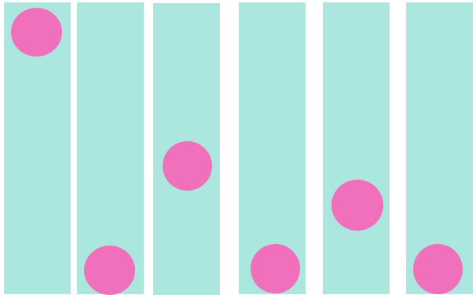
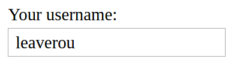
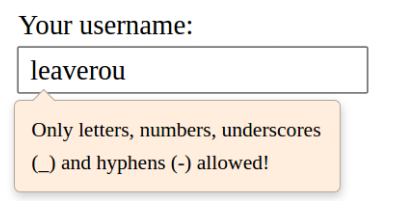
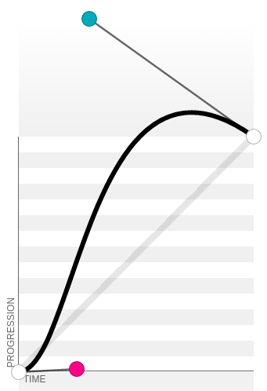
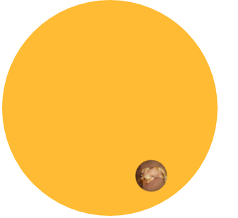

##8、过渡与动画（42~47）

由于之前未曾接触css动画，因此首先我去了解一下css动画的各种参数的定义。
> - @keyframes 规定动画。
- animation 所有动画属性的简写属性，除了 animation-play-state 属性。
- animation-name　　规定 @keyframes 动画的名称。
- animation-duration　　规定动画完成一个周期所花费的秒或毫秒。默认是 0。
- animation-timing-function　　规定动画的速度曲线。默认是 "ease"。
	1. linear    动画从头到尾的速度是相同的。
	2. ease    默认。动画以低速开始，然后加快，在结束前变慢。
	3. ease-in    动画以低速开始。
	4. ease-out    动画以低速结束。
	5. ease-in-out    动画以低速开始和结束。
	6. cubic-bezier(n,n,n,n)    在 cubic-bezier 函数中自己的值。可能的值是从 0 到 1 的数值。
	7. cubic-bezier贝塞尔曲线（动画播放速度曲线）可参考 [贝塞尔曲线](http://yisibl.github.io/cubic-bezier/#.65,.05,.36,1)
- animation-delay　　规定动画何时开始。默认是 0。
- animation-iteration-count　　规定动画被播放的次数。默认是 1。
	1. infinite无限次播放
	2. n  播放n次
- animation-direction　　规定动画是否在下一周期逆向地播放。默认是 "normal"。
	1. normal	默认值。动画按正常播放。
    2. reverse	动画反向播放。
    3. alternate	动画在奇数次（1、3、5...）正向播放，在偶数次（2、4、6...）反向播放。
    4. alternate-reverse	动画在奇数次（1、3、5...）反向播放，在偶数次（2、4、6...）正向播放。
    5. initial	设置该属性为它的默认值。
    6. inherit	从父元素继承该属性。
- animation-play-state　　规定动画是否正在运行或暂停。默认是 "running"。
	1. paused暂停
	2. running正在播放
- animation-fill-mode　　规定对象动画时间之外的状态。
    1. none    不改变默认行为。
    2. forwards    当动画完成后，保持最后一个属性值（在最后一个关键帧中定义）。
    3. backwards    在 animation-delay 所指定的一段时间内，在动画显示之前，应用开始属性值（在第一个关键帧中定义）。
    4. both    向前和向后填充模式都被应用。

###42、缓动效果

‘缓动’效果主要在运动的速度上，我们来回顾一下css动画的速度函数。
>animation-timing-function：规定动画的速度曲线。默认是 "ease"。
- linear动画从头到尾的速度是相同的。
- ease默认。动画以低速开始，然后加快，在结束前变慢。
- ease-in动画以低速开始。
- ease-out动画以低速结束。
- ease-in-out动画以低速开始和结束
- cubic-bezier(n,n,n,n)在 cubic-bezier 函数中自己的值。可能的值是从 0 到 1 的数值。

动画的进度曲线图，该曲线是贝塞尔曲线图，官方给了常见的几种曲线，如果都不能满足，则可以自己定义cubic-bezier(n,n,n,n)。

如果你熟悉css3中的赛贝尔曲线，则可以知道cubic-bezier(n,n,n,n)中的四个n分别是p1,p2的坐标cubic-bezier(x1,y1,x2,y2),x的取值范围是0 ~ 1,y的取值则是0 ～不限。一般情况下，y我们取值范围也是0 ~ 1，==特别的==，当y取值大于1的时候，则是超过动画所在范围。

- 弹跳动画

    小球自由下落并回弹，下落的过程应该是先慢后快，而弹回的过程是先快后慢。
    我们可以模拟一下小球的运动：自由落体触地后，弹跳两次。第一次弹跳高一些，第二次弹跳低一些。
    ==注意==图片横向排列只是为了方便看到不同时间，小球的运动的边界点，实际上小球做的是自由落体，x轴位移不变的，只在y轴上有位移。
    
    根据速度函数，在下落过程中，我们设置速度为ease，弹起过程先快后慢，则采用cubic-bezier(.1,.25,1,.25)速度。

    
    <pre><code>
    @keyframes bounce {
            60%, 80%, to {
                    transform: translateY(400px);
                    animation-timing-function: ease;
            }
            70% { transform: translateY(300px); }
            90% { transform: translateY(360px); }
    }

    .ball {
            width: 0; height: 0; padding: 1.5em;
            border-radius: 50%;
            margin: auto;
            background: red radial-gradient(at 30% 30%, #fdd, red);
            animation: bounce 2s cubic-bezier(.1,.25,1,.25) forwards;
    }
    </code></pre>

    从上面代码可以看出 0 ~ 60%是ease，60% ~ 70%是cubic-bezier(.1,.25,1,.25)，70% ~ 80%是ease，80% ~ 90%是cubic-bezier(.1,.25,1,.25)，90% ~ 100%是ease。

    当然，除了速度还有一些别的设置，比如时间`2s`，最后的状态`forwards`。注意时间是整个动画运行的时间，`forwards`状态在最后一个关键帧中定义。

- 弹性过渡

	这里实现了一个很酷炫的效果。当焦点不在文本框上的时候的效果：
	
    当鼠标焦点放到文本框上时，会弹出一个提示框，提示框是先慢慢放大到110%，在缩放到100%的尺寸，想象一下，是不是很酷。
    
	<pre><code>
    input:not(:focus) + .callout:not(:hover) {
            transform: scale(0);
            transition: .25s transform;
    }

    .callout {
            transition: .5s cubic-bezier(.25,.1,.3,1.5) transform;
            transform-origin: 1.4em -.4em;
    }

    </code></pre>
    
    如何实现先110%，再恢复100%呢？
    这里cubic-bezier的y值就要借助大于1的情况了。这里不太好用语言去描述。
    下图是cubic-bezier(.25,.1,.3,1.5)的曲线：
    
    x轴表示时间，y轴表示进程。通过多次实验，我得出的结论是进程也可以当做相对的子进程中的位移情况，这样说明好像更复杂了呢。。比如本例子中，动画的速度曲线只有这一种，我们可以简单理解只有`一个速度`，在同一个速度中，我们可以把这个进程中的y轴当做位移，把x轴当做时间。但是，如果不止一个速度，如上一个弹跳案例中，有了两种速度，那么我们就不可以这样理解，但是我们可以把不同的速度拆分成多段，每一段我们都可以当做一个独立的子进程，而子进程中，也可以遵循`一个速度`的特征。
    

####43、逐帧动画
逐帧动画，从字面上非常容易理解，就是一帧一帧的播放。
这里我们要学习一个新的速度函数 `steps()`
>steps() 第一个参数 number 为指定的间隔数，即把动画分为 n 步阶段性展示，第二个参数默认为 end，设置最后一步的状态，start 为结束时的状态，end 为开始时的状态。

愚的理解是，`steps()`是一个跳跃性的效果，比如本例中，长800px的背景被拆分为8个100px的区域，使用`steps(8)`就如同将该背景切割成8张图片，像薯片一样放在薯片槽里，拿走第一片，第二片就直接变成第一片了，再拿，第三片就变成第一片了，以此类推。
而贝塞尔函数是一个连续性的效果。就好像一张长长的纸上按顺序画了八幅图，镜头的区域只有一张图那么大，于是我们把镜头逐个从头扫瞄到尾，扫描第一个后，移向第二个时，镜头中间会经历包含第一幅画的一部分和第二幅画的一部分这样的场景。

哎多多联系就能了解了，语言不好描述。

<pre><code>
@keyframes loader {
        to { background-position: -800px 0; }
}

.loader {
        width: 100px; height: 100px;
        text-indent: 999px; overflow: hidden; /* Hide text */
        background: url(http://dabblet.com/img/loader.png) 0 0;
        animation: loader 1s infinite steps(8);
}
</code></pre>

---
####44、闪烁效果

闪烁效果可以有多种实现，本例中要实现的是文字一闪一闪的效果，使用`steps()`更合适一些，如果想要渐隐渐现可以使用`贝塞尔`，当然了`steps()`也可以实现渐隐渐现。

<pre><code>
@keyframes blink-1 { 50% { color: transparent } }
@keyframes blink-2 { to { color: transparent } }
p {
        padding: 1em;
        background: gold;
}
.blink-smooth-1 {
        animation: 1s blink-1 3;
}
.blink-smooth-2 {
        animation: .5s blink-2 6;
        animation-direction: alternate;
}
.blink {
        animation: 1s blink-1  infinite steps(1) ;
}
</code></pre>

---
####45、打字动画

这里使用的也是`steps()`
<pre><code>
@keyframes typing {
        from { width: 0 }
}

@keyframes caret {
        50% { border-right-color: transparent; }
}

h1 {
        font: bold 200% Consolas, Monaco, monospace;
        /*width: 8.25em;*/
        width: 15ch;
        white-space: nowrap;
        overflow: hidden;
        border-right: .05em solid;
        animation: typing 8s steps(15),
                   caret 1s steps(1) infinite;
}
</code></pre>

---
####46、状态平滑的动画

这种效果也是非常常见，较大的图片放在较小的展示框中，当鼠标焦点到展示框中时，图片会做平滑运动，展示被隐藏的部分。
比较容易理解，这里简单介绍新用的几个属性。

`animation-play-state` 动画运行状态
	运行running - 暂停paused
`animation-iteration-count`  动画重复播放次数
	n次 - infinite无限次
`animation-direction`　　规定动画是否在下一周期逆向地播放
	alternate逆向播放
    
<pre><code>
@keyframes panoramic {
        to { background-position: 100% 0; }
}

.panoramic {
        width: 150px; height: 150px;
        background: url('http://c3.staticflickr.com/3/2671/3904743709_74bc76d5ac_b.jpg');
        background-size: auto 100%;     
        animation: panoramic 10s linear infinite alternate;
        animation-play-state: paused;
}

.panoramic:hover, .panoramic:focus {
        animation-play-state: running;
}

</code></pre>

####47、沿环形路径平移的动画
居然不知不觉最后一节了

旋转我们可以用`transform`(变形)中的`rotate()`旋转的变形。

<pre><code>
@keyframes spin {
	to { transform: rotate(1turn); }
}

.avatar {
	animation: spin 3s infinite linear;
	transform-origin: 50% 150px;
}
</code></pre>

但是直接使用的话，会发现头像在做圆周运动的同时，自身也会旋转。这并不是我们想要的效果。我们希望头像自身不要旋转。

1. 需要两个元素的解决方案
	我们在图片的外层做一层反向旋转，这样头像看起来就是不动的效果。
    <pre><code>
    @keyframes spin {
        to { transform: rotate(1turn); }
    }

    .avatar {
        animation: spin 3s infinite linear;
        transform-origin: 50% 150px;
    }

    .avatar > img {
        animation: inherit;
        animation-direction: reverse;
    }
    </code></pre>
2. 需要一个元素的解决方案
    <pre><code>
    @keyframes spin {
        from {
            transform: rotate(0turn)
                       translateY(-150px) translateY(50%)
                       rotate(1turn)
        }
        to {
            transform: rotate(1turn)
                       translateY(-150px) translateY(50%)
                       rotate(0turn);
        }
    }

    .avatar {
        animation: spin 3s infinite linear;
    }
    </code></pre>
