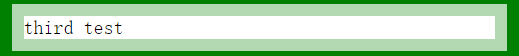
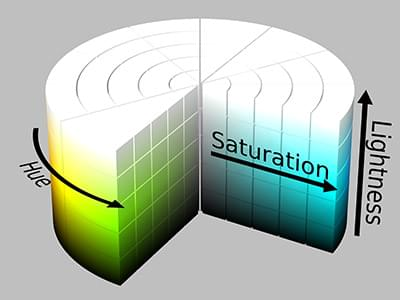
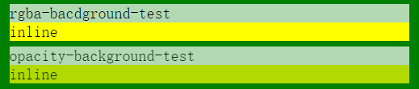

# 第二章 背景与边框

## [1]半透明边框

在引言的时候看到`HSLA`，因为之前一直都只用`RGBA`，所以还想研究一下补回到上一篇笔记，往下一翻发现第二章的第一节就有提及，那就一直放在第二篇笔记好了 ^_^


首先放上测试DEMO: [https://jsfiddle.net/aminhuang/Lfwxawg5/3/](https://jsfiddle.net/aminhuang/Lfwxawg5/3/)  (jsfiddle可能需要科学上网才能打开)

### 做一个半透明边框

**需求**：想在一个外框是其他颜色，内嵌白色背景的DIV有半透明边框，效果如图



html结构：

```
<div class="wrap">
    <div class="item first-test">
        first test
    </div>
</div>
```

最开始的简单设想：

```
.wrap {
  background: green;
  padding: 10px;
}

.item {
  margin: 5px 0;
}

.first-test {
  border: 10px solid hsla(0, 0%, 100%, .7);
  background: white;
}
```

然后出来的效果你会发现，你看不见透明边框了，只有白色背景！（见demo first test）

**原因**： 
默认情况下，DIV背景会延伸到边框所在的区域下层。 可以把`border-type`改成`dashed`看效果，见 second-test。

换句话说，因为这种做法的半透明透出来的是自己的背景颜色，而不是它上层的背景颜色。
白色的半透明，你看上去就依然还是白色。


**解决办法**： 

把`background-clip`从默认`border-box`改成`padding-box`，也就是说让DIV背景只裁剪到内边距框，那border的颜色就和里面的背景没有关系啦~

见demo third test


### HSL 与 RGB

首先，我们应该知道

> CSS 数据类型 <color> 表示一种标准RGB色彩空间（sRGB color space）的颜色。一种颜色可以用以下任意的方式来描述：

- 使用一个关键字
- 使用RGB立体坐标（RGB cubic-coordinate）系统（以“#”加十六进制或者 rgb() 和 rgba() 函数表达式的形式）
- 使用HSL圆柱坐标（HSL cylindrical-coordinate）系统（以 hsl() 和 hsla() 函数表达式的形式）


#### RGB

RGB是一种加色模型，将红（red）、绿（green）、蓝（blue）三原色的色光以不同的比例相加，以产生多种多样的色光。在css中表示方法譬如：rgb(255, 0, 0)表示红色，rgb(255, 255, 255)表示黑色。

#### HSL
> HSL和HSV都是一种将RGB色彩模型中的点在圆柱坐标系中的表示法。这两种表示法试图做到比RGB基于笛卡尔坐标系的几何结构更加直观。

**HSL**即**色相**、**饱和度**、**亮度**（英语：Hue, Saturation, Lightness），又称HSL。

**HSV**即**色相**、**饱和度**、**明度**（英语：Hue, Saturation, Value），又称HSB，其中B即英语：Brightness。

- **色相（H）**是色彩的基本属性，就是平常所说的颜色名称，如红色、黄色等。
- **饱和度（S）**是指色彩的纯度，越高色彩越纯，低则逐渐变灰，取0-100%的数值。
- **明度（V）**，**亮度（L）**，取0-100%。

HSL圆柱坐标如下图：



网络上有查到资料说这么一句话：

> hsl 相比 rgb 的优点是更加直观：HSL色彩模式是人类对颜色最直接的感知。你可以估算你想要的颜色，然后微调。它也更易于创建相称的颜色集合。

然而对于我这种其实对色彩好像并没有什么概念的人来说，好像两者并没有什么太大区别。


#### 参考资料： 
- [MDN](https://developer.mozilla.org/zh-CN/docs/Web/CSS/color_value)
- [维基百科-HSL和HSV色彩空间](https://zh.wikipedia.org/wiki/HSL%E5%92%8CHSV%E8%89%B2%E5%BD%A9%E7%A9%BA%E9%97%B4)


### HSLA 与 RGBA

这两个就很好理解了。
**RGBA**和**HSLA**就是**RGB**和**HSL**各自多了一个**阿尔法通道（alpha-channel）坐标**，即**透明度值**（取值在0到1之间）。

#### HSLA和RGBA与Opacity的区别

区别就是就是HSLA和RGBA不会影响子类的透明度；而Opacity会影响子类的透明度，从而导致子类元素的颜色产生色差。

HTML代码：

```
<div class="wrap">
    <div class="item rgba-bacdground-test">
        rgba-bacdground-test
        <div class="inline-div">
            inline
        </div>
    </div>
    <div class="item opacity-background-test">
        opacity-background-test
        <div class="inline-div">
            inline
        </div>
    </div>
</div>
```

CSS：

```
.wrap {
  background: green;
  padding: 10px;
}

.item {
  margin: 5px 0;
}

.inline-div {
  background: yellow;
}
.rgba-bacdground-test {
  background: rgba(255, 255, 255, .7);
}
.opacity-background-test {
  background: white;
  opacity: .7;
}
```

出来的效果：



可以看到在父类设置了**opacity**之后，子类拥有相同的**opacity**

