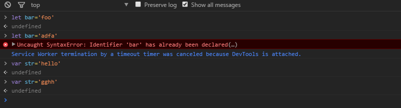
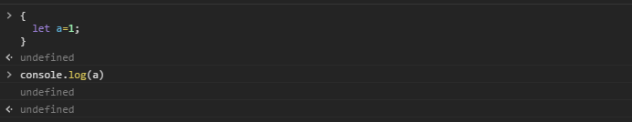
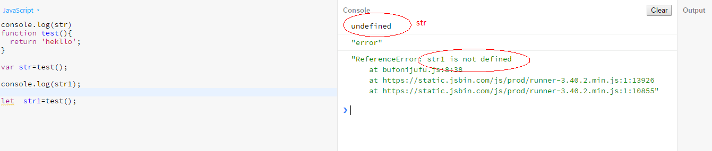
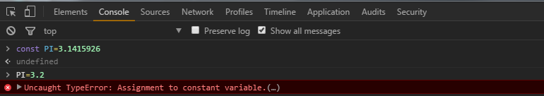
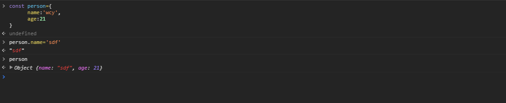

### 大家都知道，js只有全局作用域和函数作用域，并不像有的语言那样，"{}"就可以形成一个作用域，所以像是**if语句**和**循环语句**是不会形成新的作用域的

#  用**let**定义变量
## let 声明了一个块级域的局部变量，并且可以给它一个初始化值

下面是**let**和**var**的差异比较

|     | let   | var 
------|------ | ----
定义变量 | √ |√
可被释放 | √|√
可被提升 | ×|√
重复定义检查| √|×
可被用于块状作用域|√|×

## 我们需要关注的点是let是可被用于块状作用域的是会进行重复定义检查的。
我们可能在代码中重复定义了变量，但是在ES6之前的语法中，我们重复定义了变量，但是这样是没报错的。

并且let的作用域是块

还有就是**let**定义的变量是没有声明提升的

# 用**const**定义常量
在之前js是不可以定义常量的，我们通常用大写字母代表常量，比如说**var MAX_ARR_LENGTH=100**代表这是常量是不可以被修改的
但是其实上这些"**常量**"是可以被随时改变的。而**const**的引入使js获得了真正的定义常量的能力。const声明的变量只可以在声明时赋值，不可随意修改，否则会导致SyntaxError（语法错误）。

> 变量与内存之间的关系由三个部分组成：变量名，内存绑定，和内存（内存地址）。ECMAScript在对变量的引用进行读取时，会从该变量当前所对应的内存地址所指向的内存空间中读取内容。
而当用户改变变量时，引擎会重新从内存中分配一个新的内存空间以存储新的值，并将新的内存地址与变量进行绑定。const的原理便是在变量名与内存地址之间建立不可变的绑定，当后面
的程序尝试申请新的内存空间时，引擎变会抛出错误。
## ！！！但是某些情况下，并非不可改变的，如图

 由上图可见，是可以const定义的对象常量，其内容是可以通过修改属性值而改变的
 > 因为const所创建的内存绑定只是绑定一处的，所以默认情况下对象这种由若干空间片段所组成的值并不会被全部锁定。
 相对的，如上所说，字符串，数字，布尔值，undefined等值类型因为只使用了一段内存空间，所以他们若有const定义，便是天生的值不可变

# let VS var 
什么时候使用let，什么时候使用var，在ES6中遵循以下三条原则:
- 一般情况下，使用const来定义值的常量
- 只有在值在被明确会被改变时才使用let来定义变量
- 不再使用var